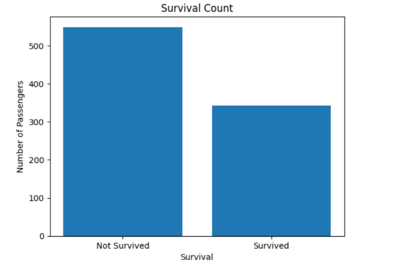
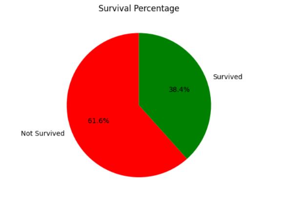

# Titanic Survival Prediction using Logistic Regression

## 📌 Overview

This project predicts whether a passenger survived the Titanic disaster using **Logistic Regression**. The project includes data exploration, data visualization, preprocessing, feature engineering, model training, and evaluation using Python.

---

## 📂 Dataset

The dataset used in this project is the **Titanic Dataset** from Kaggle.

🔗 https://www.kaggle.com/datasets/yasserh/titanic-dataset

---

## 🎯 Project Objectives

- Explore the Titanic dataset.
- Visualize passenger survival data.
- Handle missing values.
- Encode categorical features.
- Train a Logistic Regression model.
- Evaluate the model using Accuracy.

---

## 📊 Data Visualization

The following visualizations were created using **Matplotlib**:

- 📈 Survival Count (Bar Chart)
- 🥧 Survival Percentage (Pie Chart)

### Survival Count (Bar Chart)



### Survival Percentage (Pie Chart)



---

## ⚙️ Data Preprocessing

The following preprocessing steps were applied:

- Filled missing values in the **Age** column using the median.
- Filled missing values in the **Embarked** column using the mode.
- Dropped the **Cabin** column because it contains many missing values.
- Removed unnecessary columns:
  - PassengerId
  - Name
  - Ticket
- Encoded categorical columns:
  - Sex
  - Embarked

---

## 🤖 Machine Learning Workflow

1. Import Libraries
2. Load Dataset
3. Explore Dataset
4. Data Visualization
5. Data Preprocessing
6. Feature Encoding
7. Split Features and Target
8. Train-Test Split
9. Train Logistic Regression Model
10. Make Predictions
11. Evaluate Model Accuracy

---

## 🛠 Technologies Used

- Python
- Google Colab
- Pandas
- NumPy
- Matplotlib
- Scikit-learn

---

## 📈 Model

**Algorithm**

- Logistic Regression

**Evaluation Metric**

- Accuracy Score

### Model Accuracy

Replace this with your result after running the notebook.

```text
Accuracy = XX.XX%
```

---

## 📁 Project Structure

```text
Titanic-Logistic-Regression/
│
├── images/
│   ├── survival_bar_chart.png
│   └── survival_pie_chart.png
│
├── Titanic_Logistic_Regression.ipynb
├── README.md
├── requirements.txt
└── .gitignore
```

---

## 🚀 How to Run

1. Clone the repository.

```bash
git clone https://github.com/YourUsername/Titanic-Logistic-Regression.git
```

2. Install the required libraries.

```bash
pip install -r requirements.txt
```

3. Open the notebook using:

- Google Colab
- Jupyter Notebook

4. Run all cells.

---

## 👩‍💻 Author

**Shahd Ayman**

- UI/UX Designer
- Coding Instructor
- Passionate about Machine Learning and Data Analysis

---

## ⭐ If you found this project useful, feel free to star the repository!
